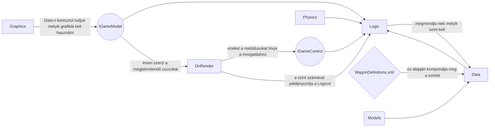

# GUI_20212202_DYHVN3
Ez a mi SZTGUI félévesünk ahol egy martalóccal kell kirabolni vonatokat.

Rétegek:

```mermaid
graph LR
Graphics[Graphics] -- Data-n keresztül tudjuk melyik grafikát kell használni --> IGameModel
Data[Data] --> Logic[Logic]
WagonDefinitions.xml{WagonDefinitions.xml} -- ez alapján komponálja meg a szintet --> Data
Models(Models) --> Data
IGameControl((IGameControl)) --> Logic
OnRender -- ezeket a metódusokat hívja a mozgatáshoz --> IGameControl
Logic -- megmondja neki melyik szint kell --> Data
IGameModel((IGameModel)) --> Logic
Physics[Physics] --> Logic
IGameModel -- innen szerzi a megjelenítendő cuccokat --> OnRender
OnRender -- a szint számával példányosítja a Logicot --> Logic
```
